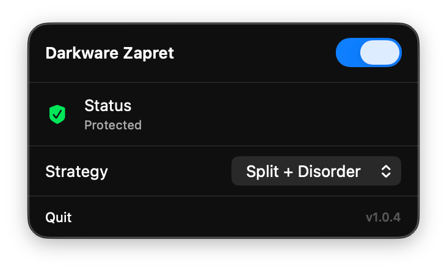

# Darkware Zapret for macOS

[](https://github.com/RoninReilly/darkware-zapret/releases/latest)
[](https://github.com/RoninReilly/darkware-zapret)
[](LICENSE)
[](https://github.com/RoninReilly/darkware-zapret/stargazers)

**[На русском](README.ru.md)**

**Darkware Zapret** is a native macOS menu bar app that wraps the [zapret](https://github.com/bol-van/zapret) DPI bypass tool into a simple one-click solution.



## Features

- **Native macOS UI** — Clean SwiftUI interface in your menu bar
- **One-Click Toggle** — Instantly enable/disable DPI bypass
- **Multiple Strategies** — Switch between bypass methods for different services
- **Auto-Start** — Launches automatically on system startup
- **Auto-Hostlist** — Automatically detects and adds blocked domains

## Installation

1. Download [`DarkwareZapret_Installer.dmg`](https://github.com/RoninReilly/darkware-zapret/releases/latest) from Releases
2. Open DMG, drag app to **Applications**
3. Launch the app
4. Click **Install Service** (requires admin password once)
5. Toggle switch to **ON**

> **Note:** If you see "App is damaged" error, run in Terminal:
> ```bash
> xattr -cr /Applications/"darkware zapret.app"
> ```

## Strategies

| Strategy | Description |
|----------|-------------|
| **Split+Disorder** | Splits TCP packet at position 1 and middle of domain name (midsld). Sends second fragment before first using `--disorder` flag. DPI expects ordered packets and fails to reassemble the hostname. |
| **TLSRec+Split** | Creates two TLS records by splitting at SNI extension boundary (`--tlsrec=sniext`). Combined with TCP split at midsld position and disorder. DPI sees incomplete TLS handshake in first record. |
| **TLSRec MidSLD** | Splits TLS record right in the middle of second-level domain (`--tlsrec=midsld`). Example: `disco` + `rd.com`. DPI cannot match partial domain against blocklist. |
| **TLSRec+OOB** | All of the above plus `--hostdot` which adds a dot after hostname in HTTP Host header. Additional confusion layer for HTTP-level DPI inspection. |

## How it Works

The app uses `tpws` transparent proxy to modify outgoing TCP traffic, bypassing DPI (Deep Packet Inspection) filters. Traffic is redirected through macOS PF firewall rules.

## Build from Source

```bash
git clone https://github.com/RoninReilly/darkware-zapret.git
cd darkware-zapret
./create_app.sh
```

> **Note:** Building requires macOS 15+ and Xcode 16+ (Swift 6). The pre-built binary from [Releases](https://github.com/RoninReilly/darkware-zapret/releases) works on macOS 13+.

## Credits

- Powered by [zapret](https://github.com/bol-van/zapret) by bol-van
- Hostlist from [Re-filter](https://github.com/1andrevich/Re-filter-lists)

## License

MIT License
